# DOCUMENTACIÓN GRUPO 4 

### Índice
[BASES DE DATOS]()
[ENTORNOS DE DESARROLLO]()
[PROGRAMACIÓN]()
[SISTEMAS INFORMÁTICOS]()
[LENGUAJE DE MARCAS]()

## BASES DE DATOS

Enmpezamos creando la base de datos "préstamos" siguiendo el enunciado entregado, generando las tablas necesarias con sus claves foráneas (como cliente_id en casi todas las tablas), unicas(como DNI ) y primarias (como cliente_id en la tabla clientes).
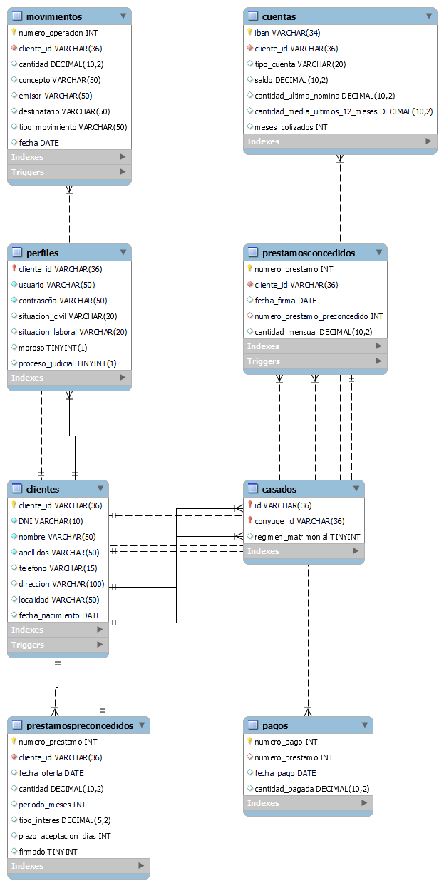

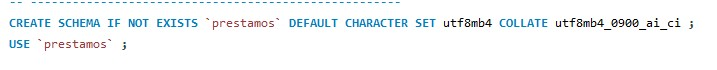

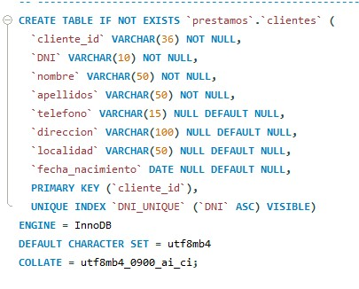

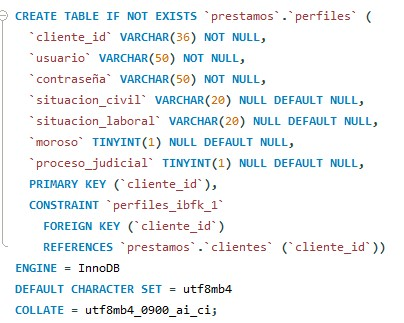

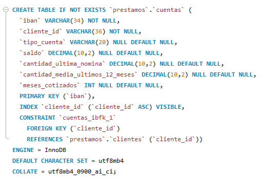

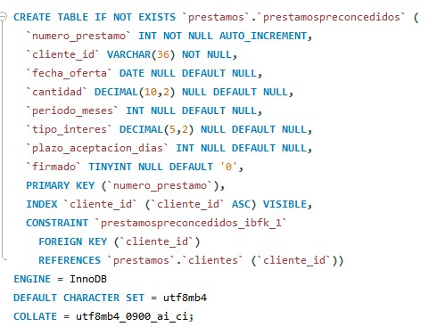

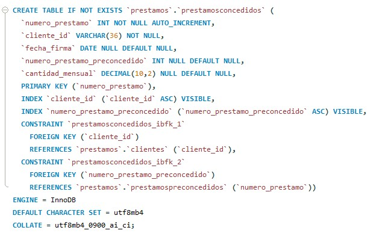

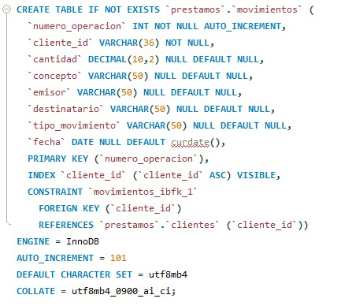

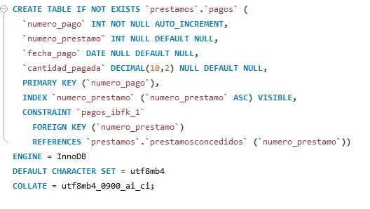

También generamos los siguientes triggers o disparadores:

 1-Crea los uuid de los clientes en el momento de la inserción
 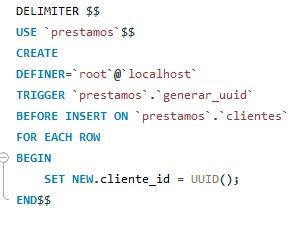
 
 2-Modifica la tabla cuentas, poniendo la cantidad del ultimo movimiemto de nombre NOMINA en la tabla movimientos
 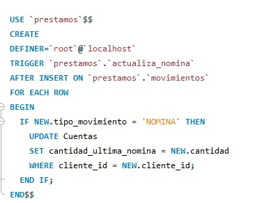

 3-Calcula la media de la nomina de los ultimos 12 meses y la pone en su columna en la tabla cuentas. Si no hay 12 nominas la deja a 0.
 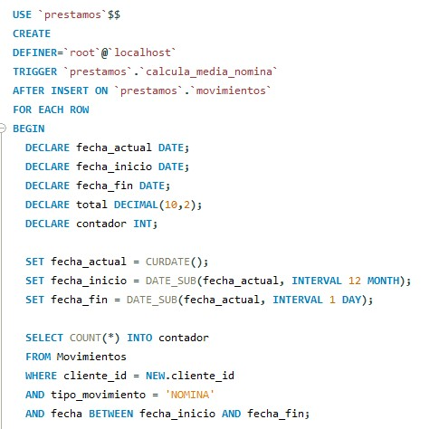
 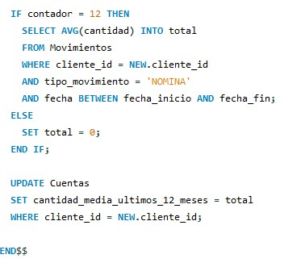

4-Calcula la cantidad de meses cotizados en el ultimo año
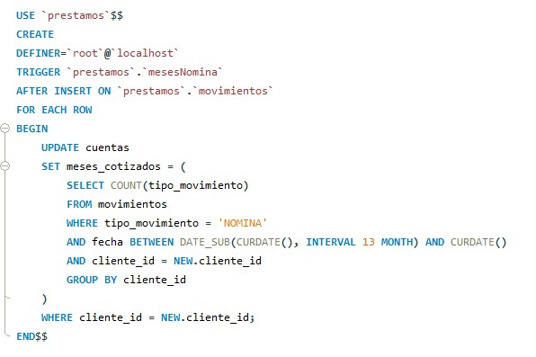

5-Modifica el atributo firmado de la tabla preconcedidos si el préstamo se inserta en la tabla concedidos
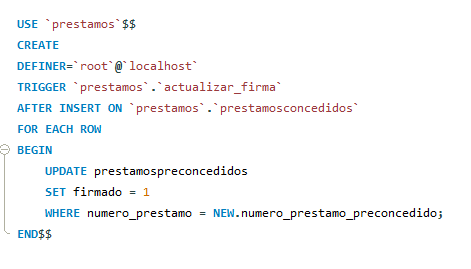

6-Modifica el saldo de la cuenta en base a las introducciones en la tabla movimientos

## ENTORNOS DE DESARROLLO
Para empezar creamos el diagrama de clases de nuestro programa, teniendo en cuenta las tablas de la base de datos y los metodos necesarios para realizar las operaciones principales, así nos queda el diguiente esquema
%20con%20métodos.jpg)

A continuación generamos un diagrama de flujo pasa saber las posibles salidas que podría tener nuestro programa, para saber las comprobaciones que deberíamos hacer para conseguir los resultados esperados.
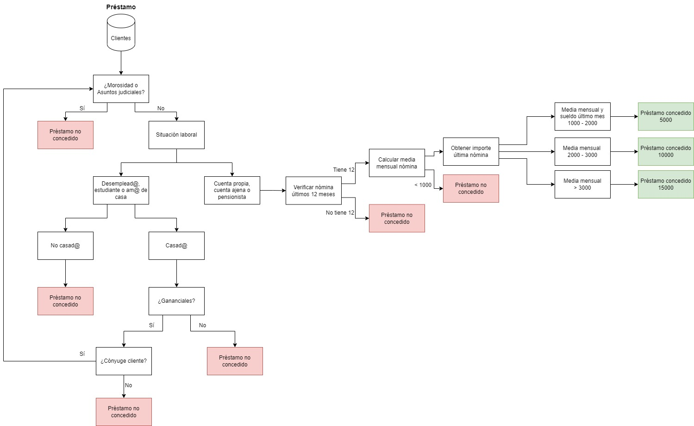

Después generamos un diagrama de los posibles casos de uso para saber el comportamiento del programa a nivel usuario:

Y para terminar un diagrama de secuencia del programa para saber la interacción de los componentes del programa desde el punto de vista de el paso de mes¡nsajes entre actores u objetos en el tiempo. Esto nos ayuda a saber el funcionamiento interno del programa 


## PROGRAMACIÓN
Usando el diagrama de clases anterior, creamos las clases principales que usaremos como objetos. Así nos salen las clases cliente, perfil, cuenta, etc...

```
public class Cliente {

    //Atributos
    private String uuid;
    private String dni;
    private String nombre;
    private String apellidos;
    private String telefono;
    private String direccion;
    private String localidad;
    private LocalDate fechaNacimiento;
    private Perfil perfil;
    private CuentaBancaria cuentaBancaria;

```
```
public class CuentaBancaria {

    //Atributos
    private String IBAN;
    private TipoCuenta tipoCuenta;
    private double saldoActual;
    private double nominaUltMes;
    private double mediaNominaAnual;
    private int mesesCotizados;
    private List<Movimiento> movimientos;

```
```
public class Pago {

    //Atributos
    private int id;
    private LocalDate fecha;
    private double cantidad;
```
```
public class Perfil {

    //Atributos
    private String usuario;
    private String password;
    private SituacionCivil situacionCivil;
    private SituacionLaboral situacionLaboral;
    private boolean esMoroso;
    private boolean procesoJudicial;
    private String idConyuge;
    private boolean gananciales;
```
Sin embargo, vimos que tanto préstamo cocedido, como préstamo preconcdido tenian atributos similares, por lo que decidimos crear una clase padre préstamo de la que heredadn dos clases: prestamoConcedido y prestamoPreConcedido, en las que los atributos cantidad y fecha se comportas de forma distinta, en los concedidos como la cantidad mensual y la fecha de firma y en los preconcedidos como cantidad total y la fecha de oferta.
```
public abstract class Prestamo {

    //Atributos
    private int id;
    private Cliente cliente;
    private LocalDate fecha;
    private double cantidad;
```
```
public class PrestamoConcedido extends Prestamo {

    //Atributos
    private PrestamoPreconcedido prestamoPreconcedido;
    private List<Pago> pagos;
```
```
public class PrestamoPreconcedido extends Prestamo implements Serializable {

    //Atributos
    private int periodoMeses;
    private double tipoInteres;
    private int plazoAceptacion;
    private boolean firmado;

```
También creamos las clases MetodosBD, en la que se crean todos los métodos estáticos que trabajan contra la base de datos; la clase funciones en la que creamos los métodos para calcular los préstamos y comprobar los datos y Ficheros en la que se generan dos informes a modo de fichero de los préstamos concedidos y preconcedidos. Estas clases están mejor explicadas en el javadoc adjunto.

Para terminar usamos java.Swing para crear una interfaz gráfica interactiva en la que creamos diferentes paneles y ventanas:

1-Pantalla solicitar, que solicita al cliente el dni, muestra sus datos y si es apto para un préstamo. Si el cliente es apto, se puede solicitar el préstamo y elegir las tasas, meses para devolver y el plazo para aceptar.
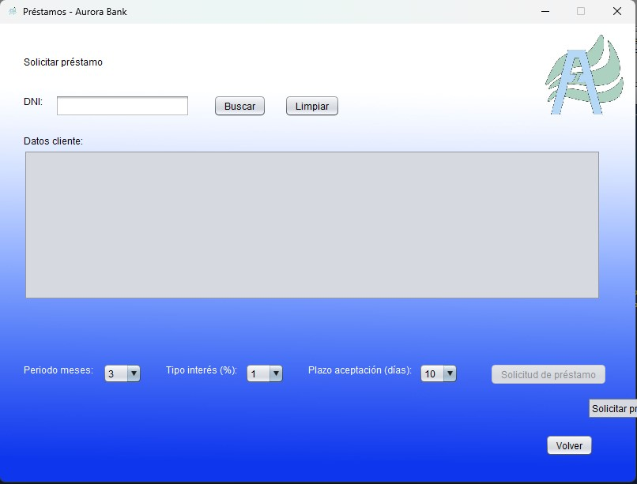

2-Pantalla calculas, que hace un cálculo masivo de préstamos de los clientes de la base de datos, mostrándolos por pantalla y pudiendo grabarlos en un fichero
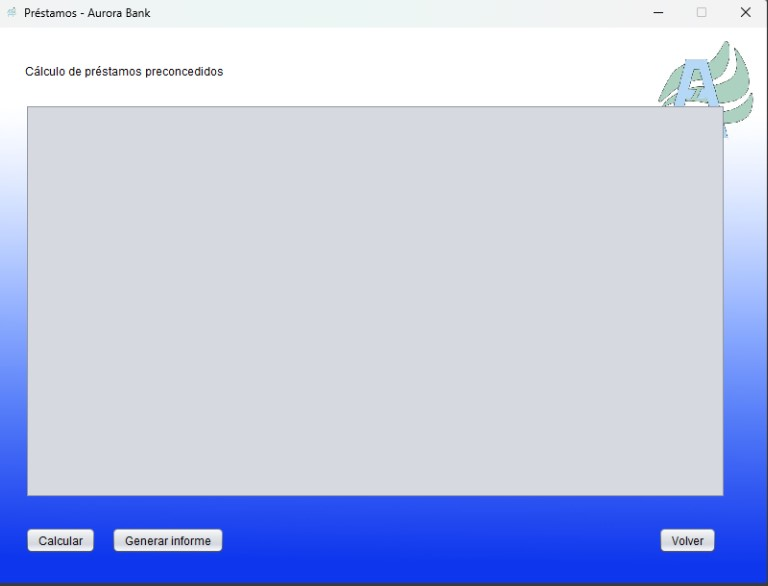

3-Pantalla mostrar, que muestra los datos de todos los préstamos preconcedidos, pero tambien permite filtrarlos por dni del cliente y localidad
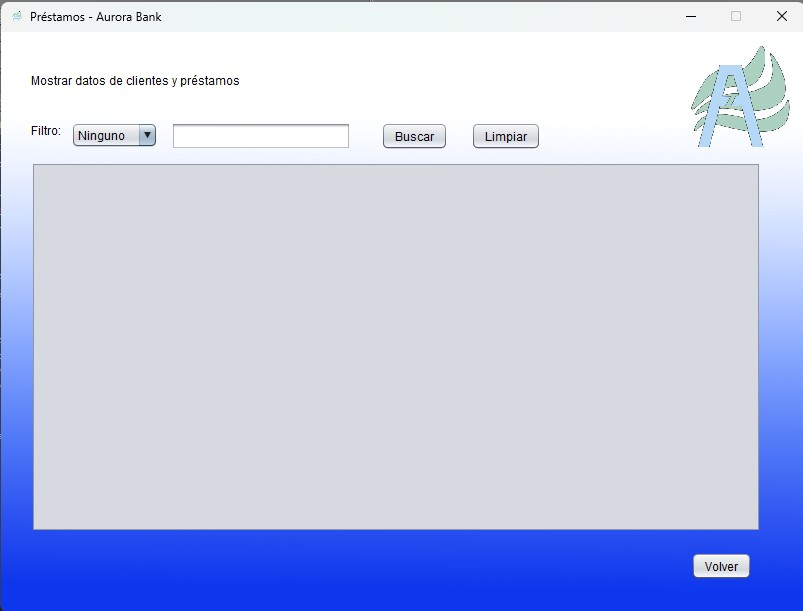

4-Pantalla firmar, que muestra los préstamos preconcedidos de un cliente en específico asi como los concedidos. También permite firmar uno de los pre concedidos y pasarlo a la tabla concedidos.
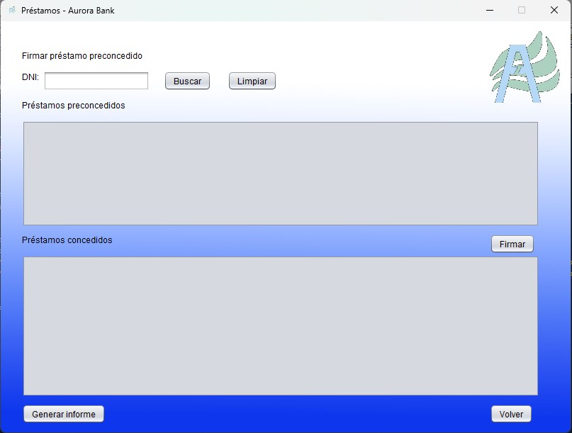


## SISTEMAS INFORMÁTICOS

Empezamos creando en entorno cleiente servidor instalando las ISOS correspondientes y conectándolas a una misma red interna. Después cambiaremos las ips de ambos para que se conecten y lo comprobamos haciendo un ping.


## LENGUAJE DE MARCAS

Creamos una página web de promoción de los préstamos con xhtml y css para los estilos. En esta página habrá un enlace que nos lleve a una página con información sobre los préstamos y finalmente a un formulario que nos permitiría solicitar un préstamo de forma remota en el caso de ser clientes o para concertar una cita en el banco en caso de no serlo.

Página de promoción
```
<!DOCTYPE html>
<html xmlns="http://www.w3.org/1999/xhtml">
    <head>
        <meta charset="UTF-8">
        <title>Aurora Bank préstamo Inmediato - Página de Promoción</title>
        <style>
            body{
                background-image: url(fondo3\ copia.jpg) ;
                background-size: cover;
            }
            .center{
                text-align: center;
                color:rgb(0, 0, 0);
            }
            .centro{
                background-image: url(cuadrado.jpg);
                text-align: center;
            }
            .large{
                font-size: 45px;
                text-align: center;
                font-family:fantasy;
            }
            .large2{
                background-color: rgb(125, 141, 194);
                margin-left: 15%;
                margin-right: 50%;
                font-size: 40px;
                text-align: left;
                font-family:fantasy;
            }
            .large3{
                
                font-size: 40px;
                text-align: left;
                font-family:fantasy;
            }
            .large4{
                background-color: rgb(0, 1, 42);
                color: rgb(255, 255, 255);
                margin-left: 58%;
                margin-right: 19%;
                float: right;
                font-size: 40px;
                text-align: center;
                font-family:fantasy;
            }
           

            
        </style>
    </head>
    <body>
        <div align="center">
            
        </div>
        <div class="large">
            
            <h1>PRÉSTAMOS PERSONALES</h1>
            <h2>Porque nosotros, estamos contigo</h2>
          
            
        </div>
        
       
        
       
        <div class="large3" align="left">
            <h2>¡No te lo pierdas y pide tu préstamo ahora!</h2>   
        </div>
        <br/>
        <br/>
        

        <div class="large2">

        <p>Recibe hasta 1500€ sin complicaciones </p>
        <p>ni tramites eternos</p>
        </div>
        <div class="large2">
        <p>Tasas muy competitivas </p>
        <p>y Flexibilidad en los plazos de pago</p>
        </div>
        <div class="large4">
            <p> <a href="web prestamos.html">Información</a></p>
        </div>

        <div class="large2">
       
        <p>Solo para clientes Aurora Bank</p>
        
        </div>
        
        <div class="centro">
        <div align="center">
            <p>Los préstamos tienen condiciones y tasas que se deben pagar todos los meses, no acepte un prestamo si no está seguro de poder pagarlo.Aurora bank se reserva el derecho de admisón. Para ser apto para el prestamo debe estar empleado o casdo con gananciales y tener unas resntas minimas de 1000 € al mes, además de haber trabajado o recibido rentas el último año</p>
            
        </div>
        <div align="left">
            <p>Aurora Bank S.L</p>
            <p>Calle Falsa,9, Porfépolis</p>
            <p>TLF.942087234</p>

        </div>
        </div>
        
</html>
```
Pagina de Información
```
<!DOCTYPE html>
<html xmlns="http://www.w3.org/1999/xhtml">
<head>
  <meta charset="UTF-8">
  <title>Aurora Bank préstamo Inmediato - Página de Promoción</title>
  <style>
    
body {
  font-family: Arial, sans-serif;
  margin: 0;
  padding: 0;
  background-color: #4f4e4e;
}

/* Estilos para el encabezado */
header {
  text-align: center;
  background-color: rgb(63, 159, 214);
  color: #fff;
  padding: 20px;
}

header h1 {
  margin: 0;
}

header  ul {
  margin: 0;
  padding: 0;
  list-style-type: none;
}

header  ul li {
  display: inline;
  margin-right: 10px;
}

header  ul li a {
  color: #fff;
  text-decoration: none;
}

/* Estilos de navigation*/
/*Hacer navigation??????????????????????*/
nav{
    text-align: left;
    color: #fff;
}

/* Estilos para las secciones */
section {
  padding: 20px;
  margin-bottom: 20px;
  background-color: #fff;
}

section h2 {
  margin-top: 0;
}

/* Estilos para el pie de página */
footer {
  background-color: #333;
  color: #fff;
  text-align: center;
  padding: 20px;
}

  </style>
</head>
<body>
  <header>
    <!-- PONER LOGO POR ALGUN LUGAR -->
    
    <h1>Préstamo Inmediato</h1>
    <nav>
      <ul>
        <li><a href="#inicio">Inicio</a></li>
        <li><a href="formulario aurora.html">Solicitud</a></li>
      </ul>
    </nav>
  </header>
  
  <section id="inicio">
    <h2>Bienvenido a Préstamo Inmediato</h2>
    <p>Ofrecemos préstamos rápidos y convenientes para clientes solventes.</p>
    <p>¡Obtén el dinero que necesitas ahora mismo!</p>
  </section>
  
  <section id="beneficios">
    <h2>Beneficios de nuestro servicio</h2>
    <ul>
      <li>Proceso rápido y sencillo</li>
      <li>Tasas de interés competitivas</li>
      <li>Flexibilidad en los plazos de pago</li>
      <li>No se requiere aval</li>
      <li>Atención al cliente las 24 horas</li>
    </ul>
  </section>
  
  <section id="requisitos">
    <h2>Requisitos para solicitar un préstamo</h2>
    <ul>
      <li>Ser mayor de 18 años</li>
      <li>Tener ingresos estables y demostrables</li>
      <li>Proporcionar documentación personal válida</li>
      <li>Tener cuenta bancaria activa</li>
      <li>Estar empleado o casado con gananciales</li>
      <li>Recibir rentas o pensión del estado</li>
    </ul>
  </section>
  
  <footer>
    <p>&copy; 2023 Préstamo Inmediato. Todos los derechos reservados.</p>
  </footer>
</body>
</html>
```
Formulario
```
<!DOCTYPE html>
<html xmlns="http://www.w3.org/1999/xhtml">
    <head>
        <meta charset="UTF-8">
        <title>Aurora Bank préstamo Inmediato - Página de Promoción</title>
        <style>
            body{
                background-color: rgb(65, 67, 68);

                }
            .form {
                width: 100%;
                max-width: 600px;
                margin: 0 auto;
                display: flex;
                flex-direction: column;
                justify-content: center;
                align-items: center;
                }
            h2{
             text-align:center;
                }
            h3{
             text-align:center;
                }

            h2 a {
                color: rgb(50,50,50);
                text-decoration: none;
                }   
            .form-container{
                 max-width:700px;
                margin: 0 auto;
                }
            .fondo{
                background-color: aqua;
                margin-left: 30%;
                margin-right: 30% ;
                }
            .fondo2{
                background-color: rgb(123, 106, 221);
                margin-left: 30%;
                margin-right: 30% ;
                }
            footer{
                background-color: rgb(31, 31, 31);
                color: azure;
                text-align: center;
                padding: 20px;
                }
        </style>
    </head>
    <body>
        <div align="center">
            
        </div>
<div class="fondo">
    <h2>Solicitar prestamo Aurora</h2>

    <h3>Clientes:</h3>
    <form class="form" >
        <label for ="DNI:">DNI:</label>
        <input type="text" id="DNI"/>
        <label for ="Nombre">Nombre:</label>
        <input type="text" id="Nombre"/>
        <label for ="Apellidos">Apellidos:</label>
        <input type="text" id="Apellidos"/>
        <label for ="Numero de Cuenta">Nº de Cuenta</label>
        <input type="text" id="Numero de cuenta"/>
        <label for ="Usuario">Usuario:</label>
        <input type="text" id="Usuario"/>
        <label for ="Contraseña">Contraseña:</label>
        <input type="password" id="contraseña"/> 
        <button type="submit" >Solicitar</button>
    </form>
</div>

<div class="fondo2">
    <h3> No Clientes:</h3>
    <p>Rellena el siguiente formulario y recibirás un correo concertando una cita en nuestras oficinas</p>
        <form class="form-container" >
            <label for ="DNI:">DNI:</label>
            <input type="text" id="DNI"/>
            <label for ="Nombre">Nombre:</label>
            <input type="text" id="Nombre"/>
            <label for ="Apellidos">Apellidos:</label>
            <input type="text" id="Apellidos"/>
            <label for ="Correo">Correo electrónico:</label>
            <input type="email" id="Correo"/>
            <label for ="Fecha">Fecha de nacimiento:</label>
            <input type="date" id="Fecha"/>
            <button type="submit" >Enviar</button>
        </form>
</div>
<br/>
<br/>
    <footer>
        <p>&copy; 2023 Préstamo Inmediato. Todos los derechos reservados.</p>
      </footer>


</html>
```